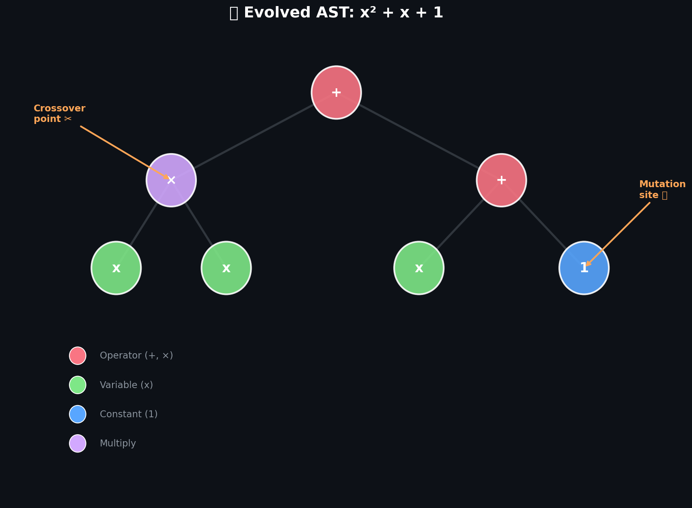
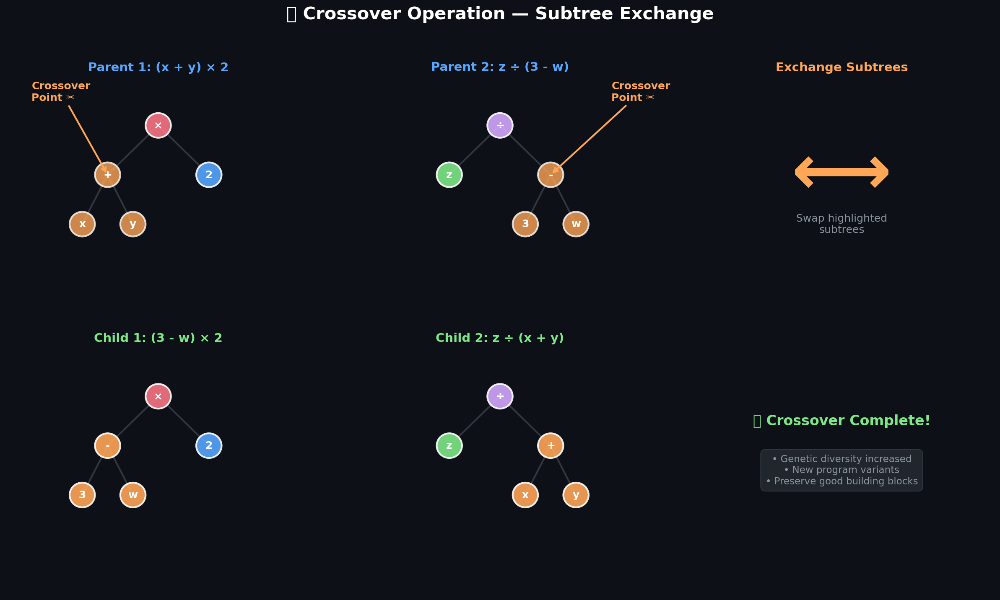
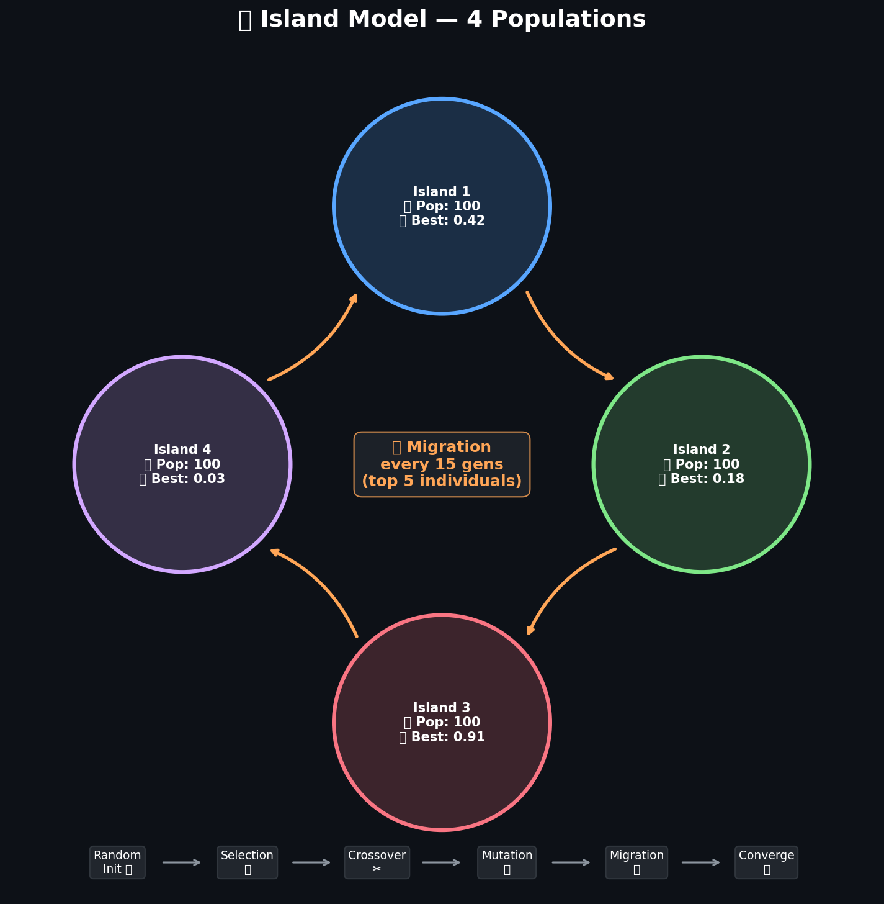
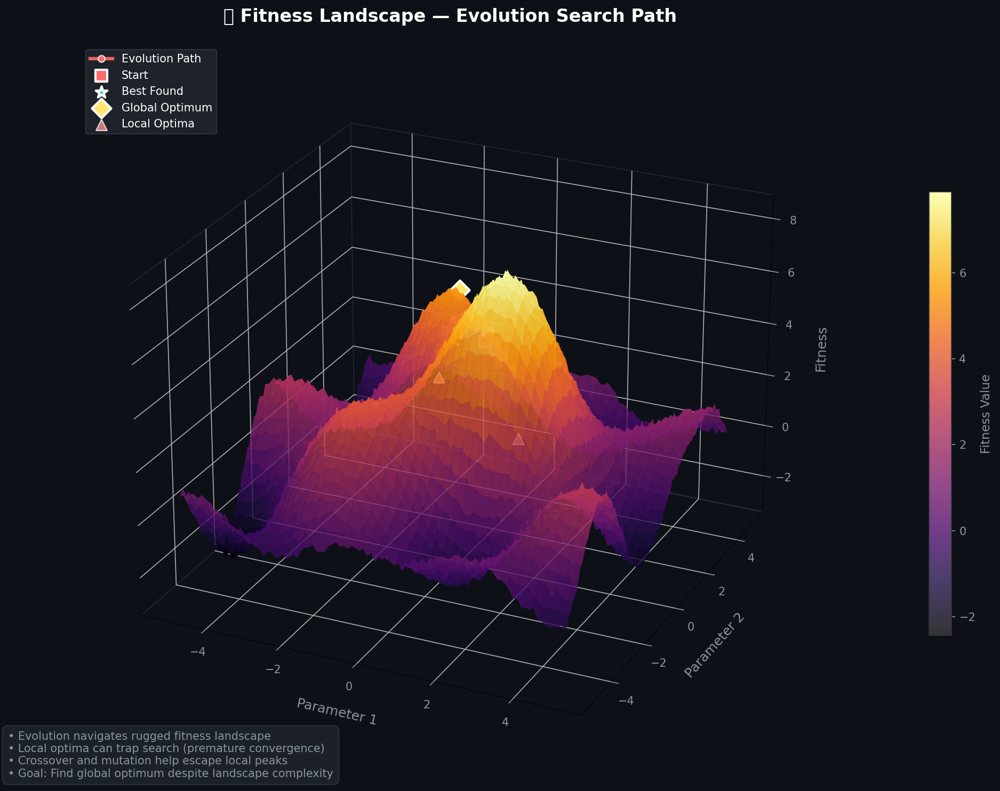
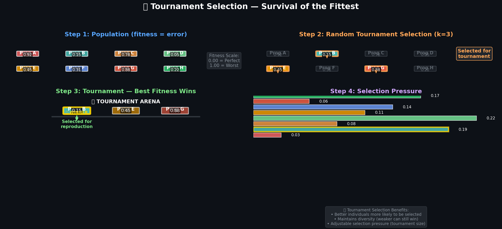
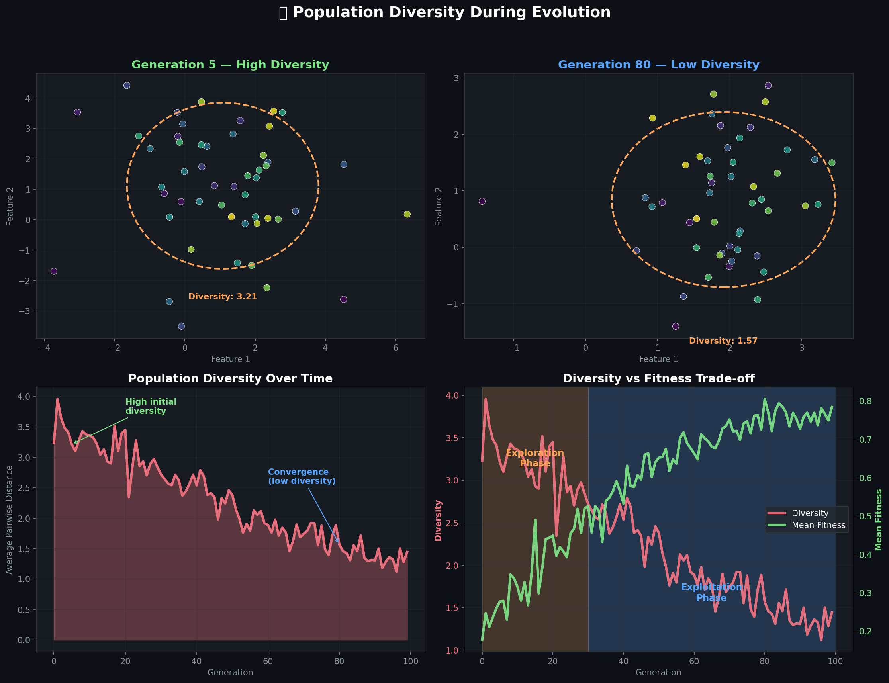
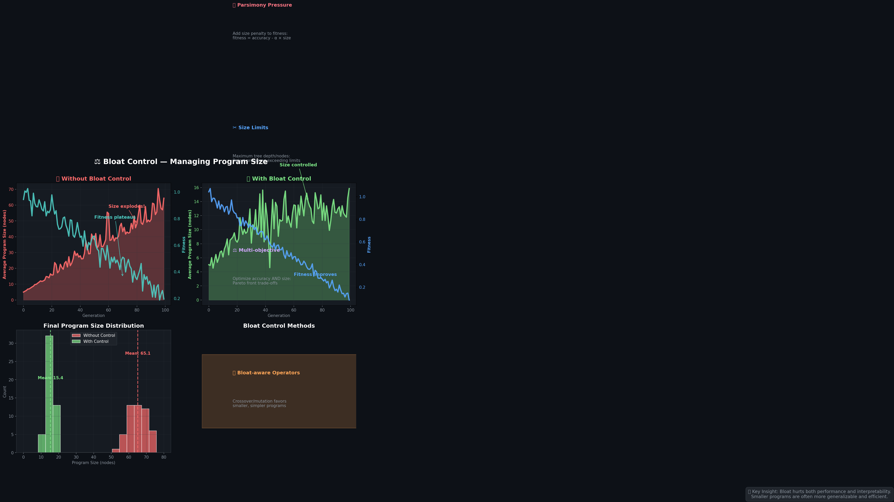

# 🧬 genlang — Self-Evolving Programming Language

> Programs that write themselves through evolution

[](https://github.com/your-repo/genlang/actions)
[](https://crates.io/crates/genlang)
[](LICENSE)
[](#)

**genlang** is a genetic programming framework that evolves programs from scratch using evolutionary algorithms. Watch as random code mutates, crossbreeds, and gradually evolves toward optimal solutions—no human programming required!

## 🎬 See It In Action

### Evolution Animation


Watch populations of random programs evolve in real-time! The red line shows the best program converging toward the blue target function through generations of selection, crossover, and mutation.

### AST Tree Structure  


Programs are represented as expression trees (ASTs). Each node can be modified through genetic operations—crossover points and mutation sites are highlighted, showing how evolution reshapes program structure.

### Crossover — Genetic Recombination


**Crossover combines successful programs:** Two parent programs exchange subtrees (highlighted in orange), creating child programs that inherit traits from both parents. This is how evolution discovers new combinations of useful code patterns.

### Mutation Types — Introducing Variation


**Four types of mutations drive evolutionary diversity:**
- **🎯 Point Mutation:** Change a single node's value (3 → 7)
- **🌳 Subtree Mutation:** Replace entire branches with new random code
- **⬆️ Hoist Mutation:** Promote a subtree to replace its parent (simplification)
- **⬇️ Shrink Mutation:** Replace complex subtrees with simple terminals

### Island Model — Parallel Evolution


**Multiple populations evolve in parallel:** Each island maintains its own gene pool, with periodic migration of the best individuals. This prevents premature convergence and maintains genetic diversity across the entire system.

### Fitness Landscape — The Search Space


**Evolution navigates rugged fitness landscapes:** The 3D surface shows how program fitness varies across different parameter combinations. Red dots trace the evolutionary path as populations climb toward optimal solutions, avoiding local optima through genetic operators.

### Tournament Selection — Survival of the Fittest


**Selection pressure drives improvement:** Random tournaments pick the best individuals for reproduction. Higher fitness = better selection probability, but weaker programs can still win occasionally, preserving diversity.

### Population Diversity Over Time


**Balancing exploration and exploitation:** Early generations spread widely (high diversity, exploration), while later generations converge toward optimal solutions (low diversity, exploitation). The fitness-diversity trade-off is crucial for successful evolution.

### Bloat Control — Managing Program Complexity


**Preventing runaway growth:** Without control, program size explodes while fitness plateaus (red). Parsimony pressure keeps programs compact while improving fitness (green), leading to more interpretable and efficient solutions.

### 3D Symbolic Regression Evolution


**Evolution in action:** Watch a 3D animation of genetic programming discovering the target function x² + y². The evolved surface (red→green) gradually converges to match the target blue surface through evolutionary search.

---

## 🚀 Quick Start

### Installation

```bash
# Install from crates.io
cargo install genlang

# Or build from source
git clone https://github.com/your-repo/genlang
cd genlang
cargo build --release
```

### Basic Usage

```bash
# Run symbolic regression example
cargo run --example symbolic_regression

# Evolve solutions to the even parity problem
cargo run --example even_parity

# Custom fitness function
cargo run --example custom_fitness
```

### Simple API Example

```rust
use genlang::{Population, Config, FitnessFunction};

// Define your fitness function
let fitness_fn = |program: &Program| -> f64 {
    // Your evaluation logic here
    program.evaluate(&test_data)
};

// Configure evolution parameters  
let config = Config::new()
    .population_size(100)
    .generations(50)
    .tournament_size(3)
    .crossover_rate(0.8)
    .mutation_rate(0.1);

// Evolve solutions
let mut population = Population::random(&config);
let best = population.evolve(&fitness_fn, &config);

println!("Best program: {}", best.to_string());
```

---

## 📖 How It Works

**genlang** implements classic genetic programming with modern optimizations:

### Core Algorithm
1. **🎲 Initialize:** Create random population of expression trees
2. **📊 Evaluate:** Test each program against fitness function  
3. **🏆 Select:** Tournament selection picks parents for reproduction
4. **✂️ Crossover:** Exchange subtrees between parent programs (80% rate)
5. **🎯 Mutate:** Randomly modify program structure (10% rate)  
6. **👥 Replace:** New generation replaces old population
7. **🔄 Repeat:** Continue until convergence or generation limit

### Key Features
- **Expression trees as genomes** — Programs represented as manipulable tree structures
- **Tournament selection** — Balanced selection pressure with diversity preservation
- **Subtree crossover** — Genetic recombination that preserves program validity
- **Multi-type mutation** — Point, subtree, hoist, and shrink operations
- **Elitism** — Best individuals always survive to next generation
- **Island model** — Parallel populations with periodic migration
- **Bloat control** — Parsimony pressure prevents program size explosion
- **Type safety** — Strongly-typed GP ensures valid program generation

---

## 🧪 Built-in Problems

### Symbolic Regression
Discover mathematical functions from data points:
```bash
cargo run --example symbolic_regression
# Evolves: x² + 3x + 1 (from input/output samples)
```

### Even Parity
Learn boolean logic functions:
```bash  
cargo run --example even_parity
# Evolves: XOR-based circuits for even parity detection
```

### Time Series Prediction
Forecast future values from historical data:
```bash
cargo run --example time_series  
# Evolves: Recursive functions for sequence prediction
```

### Custom Fitness Functions
Define your own optimization objectives:
```rust
// Minimize program size while maximizing accuracy
let fitness_fn = |program: &Program| -> f64 {
    let accuracy = program.test_accuracy(&data);
    let size_penalty = program.size() as f64 * 0.01;
    accuracy - size_penalty
};
```

---

## 📊 Advanced Features

### Multi-Objective Optimization
Optimize multiple conflicting objectives simultaneously:
```rust
let config = Config::new()
    .multi_objective(vec![
        objective::Accuracy,
        objective::Simplicity,
        objective::Speed,
    ])
    .pareto_tournament_size(7);
```

### Automatic Feature Construction
Evolve complex features from raw inputs:
```rust
let config = Config::new()
    .enable_adfs()  // Automatically Defined Functions
    .max_adf_depth(3)
    .adf_count(2);
```

### Parallel Island Evolution
Scale across multiple CPU cores:
```rust
let config = Config::new()
    .islands(4)
    .migration_interval(10)
    .migration_rate(0.1)
    .topology(Topology::Ring);
```

### Dynamic Fitness Landscapes
Adapt to changing environments:
```rust
let mut fitness_fn = DynamicFitness::new()
    .change_every(25)
    .transition_smoothing(0.9);
    
population.evolve_adaptive(&mut fitness_fn, &config);
```

---

## 🏗️ Architecture

```
genlang/
├── src/
│   ├── lib.rs              # Public API
│   ├── population.rs       # Population management
│   ├── individual.rs       # Program representation
│   ├── operators/          # Genetic operators
│   │   ├── crossover.rs    # Subtree crossover
│   │   ├── mutation.rs     # All mutation types
│   │   └── selection.rs    # Tournament selection
│   ├── fitness/            # Fitness evaluation
│   ├── island.rs           # Island model evolution
│   ├── config.rs           # Configuration management
│   └── utils/              # Utilities and helpers
├── examples/               # Example problems & visualizations
├── benches/                # Performance benchmarks  
└── tests/                  # Integration tests
```

### Performance Characteristics
- **Memory:** O(population_size × avg_program_size)  
- **Time per generation:** O(population_size × evaluation_time)
- **Parallel scaling:** Near-linear with island model
- **Typical speed:** 1000+ evals/sec on modern hardware

---

## 🎯 Use Cases

### Scientific Computing
- **Symbolic regression:** Discover physical laws from experimental data
- **Feature engineering:** Automatically construct predictive features  
- **Model discovery:** Find interpretable alternatives to black-box ML

### Optimization  
- **Parameter tuning:** Evolve optimal hyperparameters
- **Architecture search:** Design neural network architectures
- **Resource allocation:** Optimize scheduling and routing problems

### Creative Applications
- **Procedural generation:** Evolve game content, art, and music
- **Code generation:** Automatically write specialized algorithms
- **Design optimization:** Engineer better mechanical and electronic designs

### Research & Education
- **Algorithm discovery:** Find novel computational approaches
- **Artificial life:** Study evolutionary dynamics and emergence
- **Teaching tool:** Visualize evolutionary computation concepts

---

## 📚 References & Further Reading

### Foundational Papers
- Koza, J.R. (1992). *Genetic Programming: On the Programming of Computers by Means of Natural Selection*
- Poli, R., Langdon, W.B., McPhee, N.F. (2008). *A Field Guide to Genetic Programming*
- Luke, S. (2013). *Essentials of Metaheuristics: A Set of Undergraduate Lectures*

### Key Concepts
- **Building Block Hypothesis:** Good solutions combine smaller good solutions
- **Schema Theorem:** Evolution tends to preserve and combine successful patterns  
- **No Free Lunch:** No single algorithm works best for all problems
- **Bloat:** Tendency for programs to grow without fitness improvement
- **Diversity-Accuracy Trade-off:** Balance between exploration and exploitation

### Modern Advances
- **Semantic GP:** Consider program behavior, not just structure
- **Geometric Semantic GP:** Smooth fitness landscapes through semantic operators
- **Multi-tree GP:** Multiple cooperating trees per individual
- **Grammar-guided GP:** Constrain search with domain-specific grammars

### Online Resources
- [GP Bibliography](http://www.cs.bham.ac.uk/~wbl/biblio/) - Comprehensive research papers
- [GECCO Conference](https://gecco-2024.sigevo.org/) - Premier evolutionary computation venue
- [/r/MachineLearning](https://reddit.com/r/MachineLearning) - Active research discussions
- [EC-Net](http://www.evolutionary-computation.org/) - Evolutionary computation community

---

## 🤝 Contributing

We welcome contributions! See [CONTRIBUTING.md](CONTRIBUTING.md) for guidelines.

### Development Setup
```bash
git clone https://github.com/your-repo/genlang  
cd genlang
cargo test           # Run test suite
cargo bench          # Performance benchmarks
cargo doc --open     # Generate documentation
```

### Areas for Contribution
- 🧬 New genetic operators and selection methods
- 📊 Additional visualization and analysis tools  
- 🎯 Domain-specific fitness functions and problems
- ⚡ Performance optimizations and parallelization
- 📖 Documentation, tutorials, and examples
- 🐛 Bug fixes and code quality improvements

---

## 📄 License

Licensed under the **Apache License 2.0** - see [LICENSE](LICENSE) file for details.

---

## 🌟 Star History

[](https://star-history.com/#your-repo/genlang&Date)

---

*"Evolution is a powerful algorithm. It built every living thing you see around you. Now it can build your programs too."*

**Ready to evolve?** `cargo install genlang` 🚀